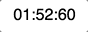

# React Countdown

A reusable React component to abstract away the countdown logic so you can focus on the layout.



## Installing

### Install via yarn

```sh
    yarn add jackkav/react-countdown
```

#### Use the React [render props](https://cdb.reacttraining.com/use-a-render-prop-50de598f11ce) pattern, design your own layout

In the following example, spline is the random loading text.

```jsx
import { Countdown } from "@jackkav/react-countdown";
let thirtyMins = new Date();
thirtyMins = new Date(thirtyMins.setMinutes(thirtyMins.getMinutes() + 30));

<Countdown date={thirtyMins}>
  {({ timeLeft, hasStopped }) => (
    <div>
      {hasStopped ? (
        <p>Times up!</p>
      ) : (
        <p>
          {timeLeft.hours}:{timeLeft.minutes}:{timeLeft.seconds}
        </p>
      )}
    </div>
  )}
</Countdown>;
```

## Development

First you'll need [NodeJS](http://nodejs.org), and then you'll need to run `yarn`.

```sh
    yarn build:watch
```

This will watch for changes and build the minified script.

## TODO

- [x] basic unit tests
- [x] babel 7
- [ ] define API
- [ ] fix initial render flash
- [ ] simplify
